# Offline CBT Platform

An offline-first Computer-Based Examination platform for secondary schools.

  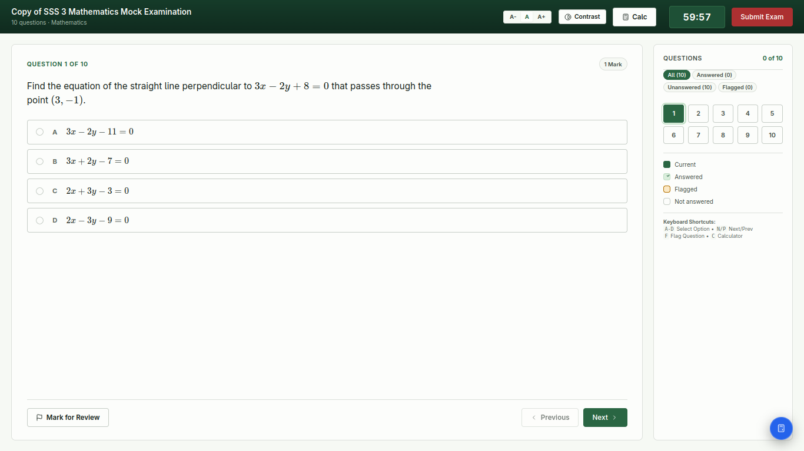

I built this because I remember what it was like taking computer-based exams in secondary school when the network wasn't cooperating.

Sometimes we'd be in the middle of an exam and the next question simply wouldn't load. The timer would keep running while we waited. Other times the connection would get so bad that the whole exam had to be stopped and continued later when the network was better.

That always felt wrong to me. An exam shouldn't fall apart because the internet decided to misbehave.

So I wanted to build a CBT system that could work on a school's local network without depending on the internet, and more importantly, one where a temporary network problem wouldn't mean losing your progress.

## What it does

The platform lets a school run computer-based examinations entirely over its local network.

- Teachers can create and manage examinations
- Students can take exams from any computer connected to the school network
- Exam progress is saved locally as the student works
- Students can resume an exam after a refresh or crash
- Exams can continue even when the network connection becomes unreliable
- Answers are submitted and graded by the server
- Invigilators can monitor active exams and security violations
- Results can be released immediately or withheld until the school is ready
- The system includes question shuffling, question banks, a scientific calculator, LaTeX maths support and other examination features

## The interesting part

The main idea behind the system is simple:

**the exam shouldn't depend on a perfect network connection.**

When a student starts an exam, the browser receives the examination without the answer keys. The questions and the student's progress are then kept locally while the exam is running.

If the browser refreshes, crashes, or the connection temporarily disappears, the student can continue from where they stopped.

The server remains responsible for grading. Answers are sent back when the student submits, and the server grades them against the original answer keys.

This means the browser can keep the exam running without being trusted to determine the result.

## How it works

The application is built as a single executable that runs on a school's computer and acts as the exam server.

Other computers on the same LAN connect to it through a browser.

The backend is written in Go and uses SQLite for storage. The frontend uses vanilla JavaScript, HTML and CSS, with KaTeX for mathematical notation.

The frontend is embedded directly into the Go binary, so deploying the system doesn't require installing a separate web server, database server or runtime.

### Tech

`Go` `SQLite` `net/http` `JavaScript` `HTML` `CSS` `KaTeX`

## Screenshots

### Server Control Panel

The server starts with a small control panel showing the LAN address that students can use to connect.

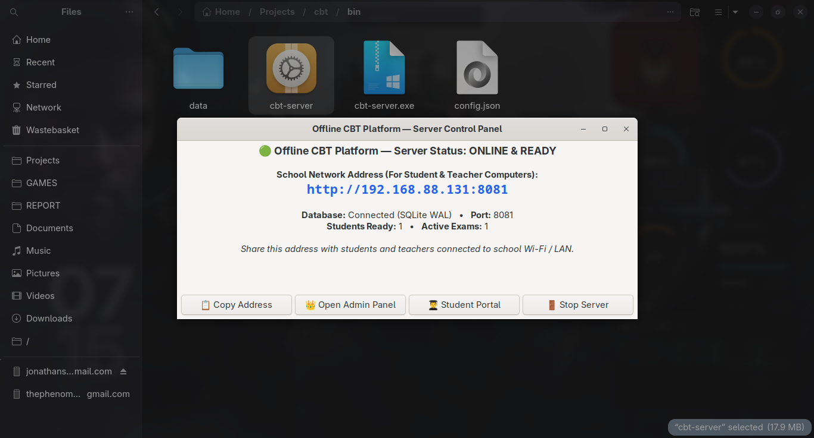

### Exam Management

Examinations can be created, configured and moved through their different stages.

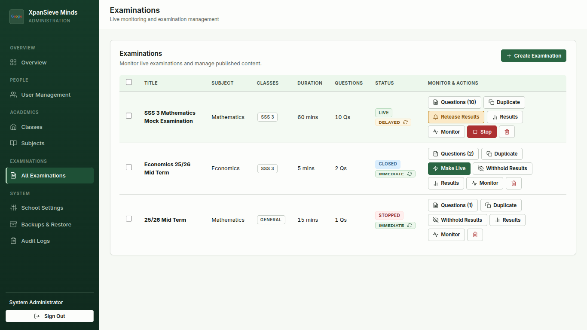

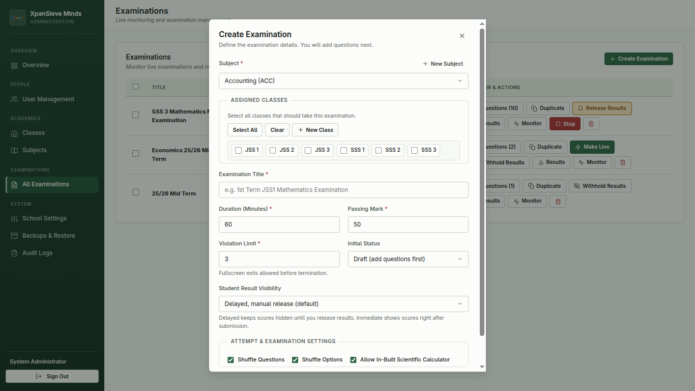

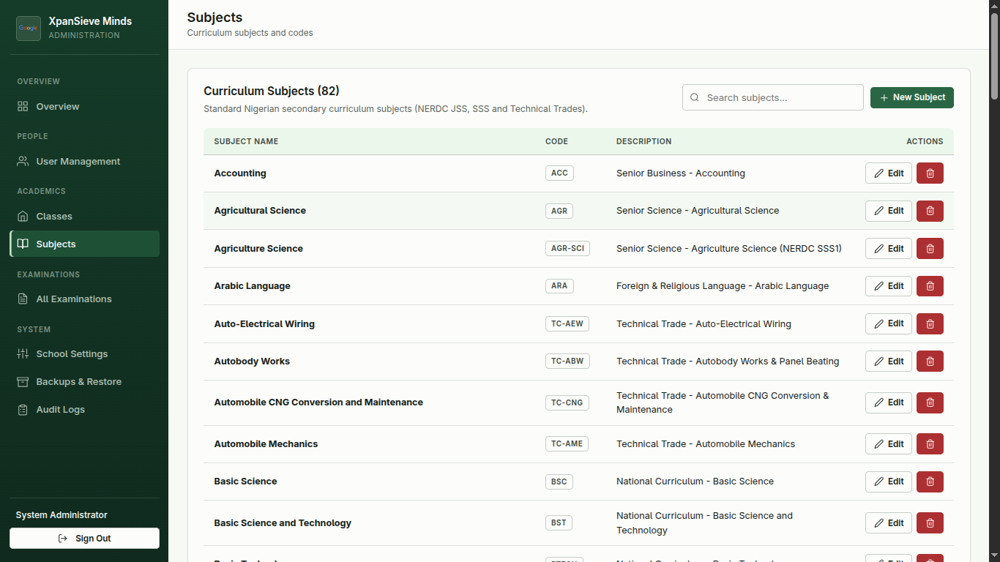

### Student Examination

The examination interface keeps the student's progress locally while they work.

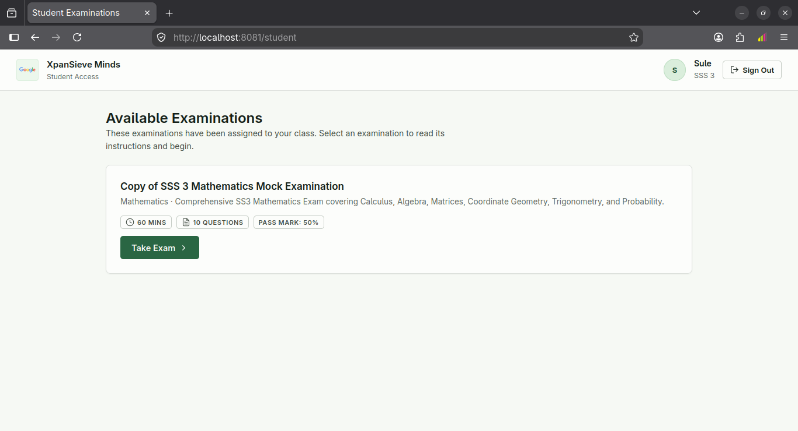

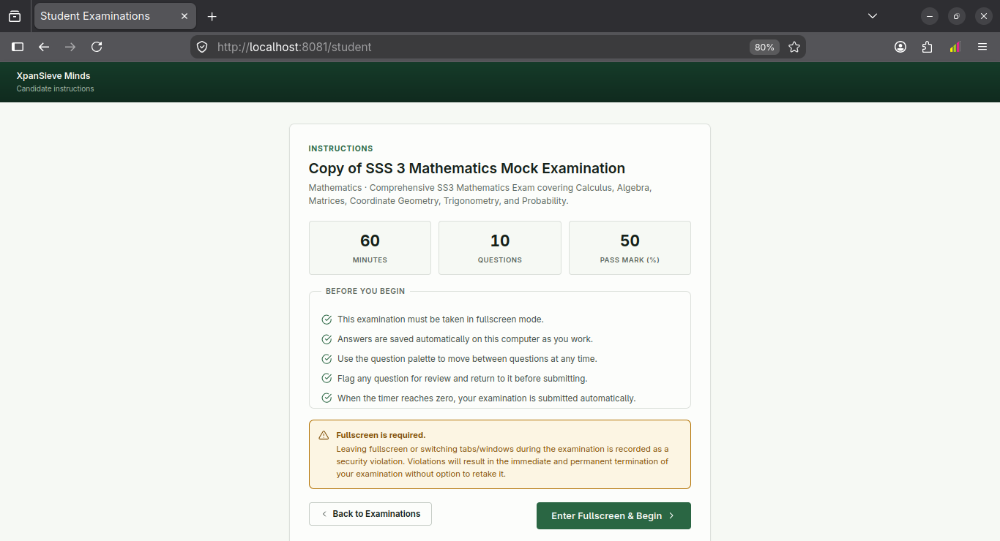

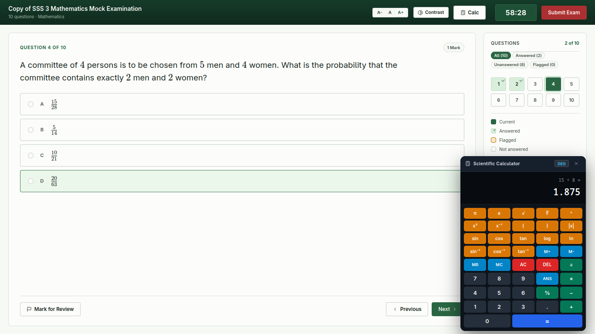

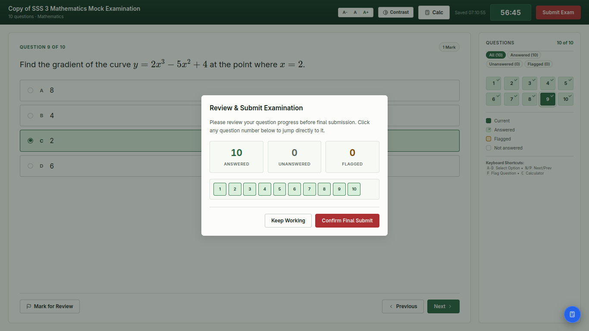

### Live Invigilation

Invigilators can see active candidates, their progress and recorded security violations.

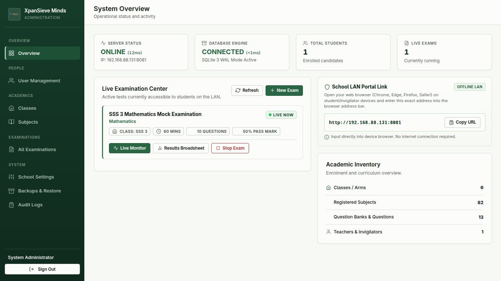

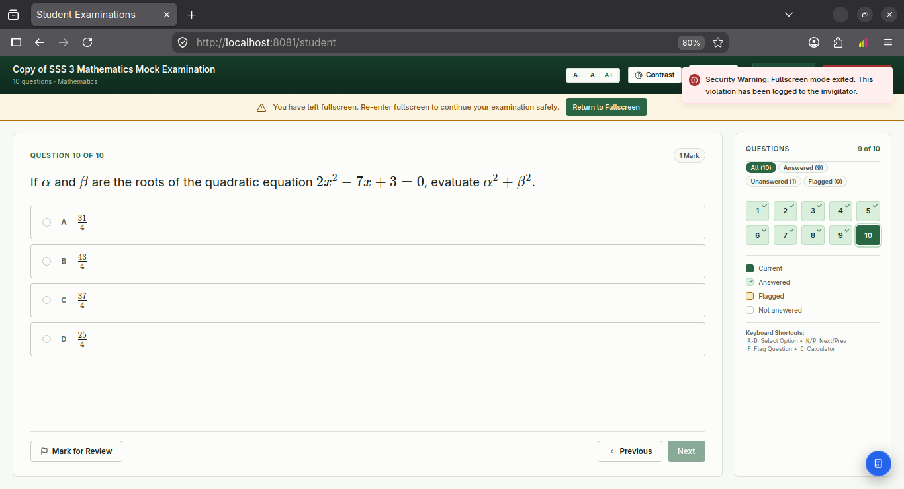

### Results

Results can be reviewed by the school and released when appropriate.

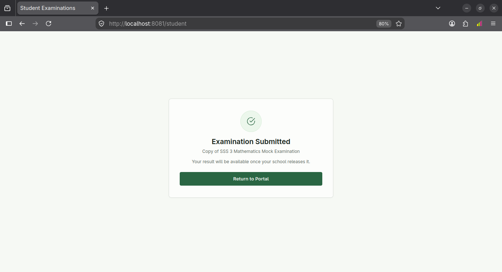

## Why this project matters to me

This started with a problem I experienced as a student.

I wanted to see if I could take something that had repeatedly frustrated me, unreliable connectivity during an exam, and design a system where that problem wasn't allowed to ruin the entire experience.

It's also been one of the projects that has pushed me to think more carefully about reliability, data consistency, local storage, security and what should happen when the network can't be trusted.

## Source code

The source code isn't public because this is a private project.
